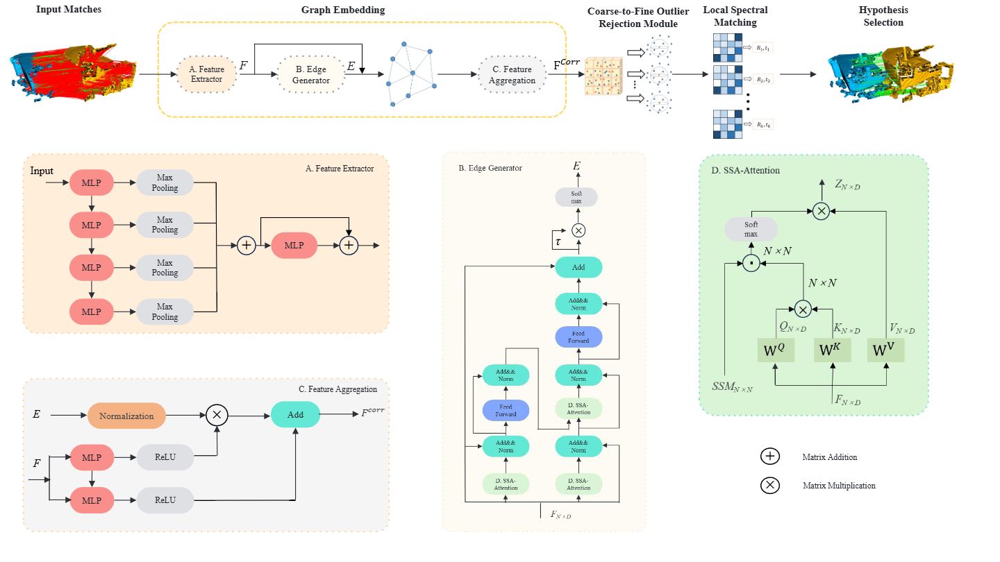

# Enhancing Point Cloud Registration through Graph Embedding and Coarse-to-Fine Outlier Rejection



## Installation

**Step-1:** Create a new conda environment

```shell
conda create -n C2FOR python=3.8
conda activate C2FOR

pip install torch==1.9.0 torchvision==0.10.0
```

**Step-2:** Install C2FOR

```shell
git clone https://github.com/JiangxinGao-JLU/C2FOR
cd C2FOR
pip install -e .
```

## Prepare data

**Dataset:**  

The 3DMatch dataset is available at https://3dmatch.cs.princeton.edu/#rgbd-reconstruction-datasets.  
The 3DLoMatch dataset is available at https://share.phys.ethz.ch/∼gsg/Predator/.  
The Kitti dataset is available at https://www.cvlibs.net/datasets/kitti/index.php.


This project supports FCGF (Fully Convolutional Geometric Features) as the correspondence descriptor. We provide download links for two commonly used pretrained checkpoints:

3DMatch:http://node2.chrischoy.org/data/projects/DGR/ResUNetBN2C-feat32-3dmatch-v0.05.pth  
KITTI:http://node2.chrischoy.org/data/projects/DGR/ResUNetBN2C-feat32-kitti-v0.3.pth

```shell
python cal_fcgf.py
python cal_fpfh.py
```

## Train & Evaluate

Using the following command to train & evaluate C2FOR

```shell
python train_3DMatch.py
python train_KITTI.py
python test_3DLoMatch.py
python test_3DMatch.py
python test_KITTI.py
```

